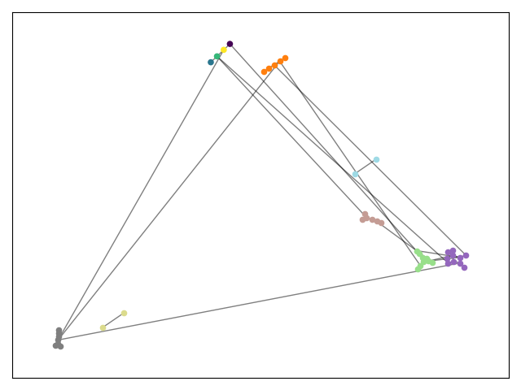

# Community Detection

见任务书

## 测试与可视化

可以生成较小的图来验证算法的正确性。

如下命令可以生成 50 个顶点，每两个点之间存在边的概率为 0.05 的图，并将边表保存到 edgelist.txt：

```console
$ ./gen_random_graph.py 50 0.05 edgelist.txt
```

使用 networkx 提供的 louvain 实现，并输出社区数和模块度：

```console
$ ./partition.py cit-HepPh.txt
graph: communities=82, modularity=0.6685685100745147
```

使用本项目实现的 louvain 算法，输出社区数和模块度（省略了部分输出），可以发现比 netwrokx 的效果更好：
```console
$ SHOW_PROCESS=false cargo run --release  -- datasets/cit-HepPh.txt                       
init: communities=34546, degrees=841842, modularity=0.000029116813324629766
epoch 1: communities=906, degrees=841842, modularity=0.6430505387041099
epoch 2: communities=118, degrees=841842, modularity=0.7145259723075886
epoch 3: communities=83, degrees=841842, modularity=0.7200554567369007
epoch 4: communities=83, degrees=841842, modularity=0.7200554567369007
```

对于一些小图，不仅可以计算还可以可视化：

```console
$ DRAW= ./partition.py small-graph.txt
graph: communities=8, modularity=0.511094674556213
```


